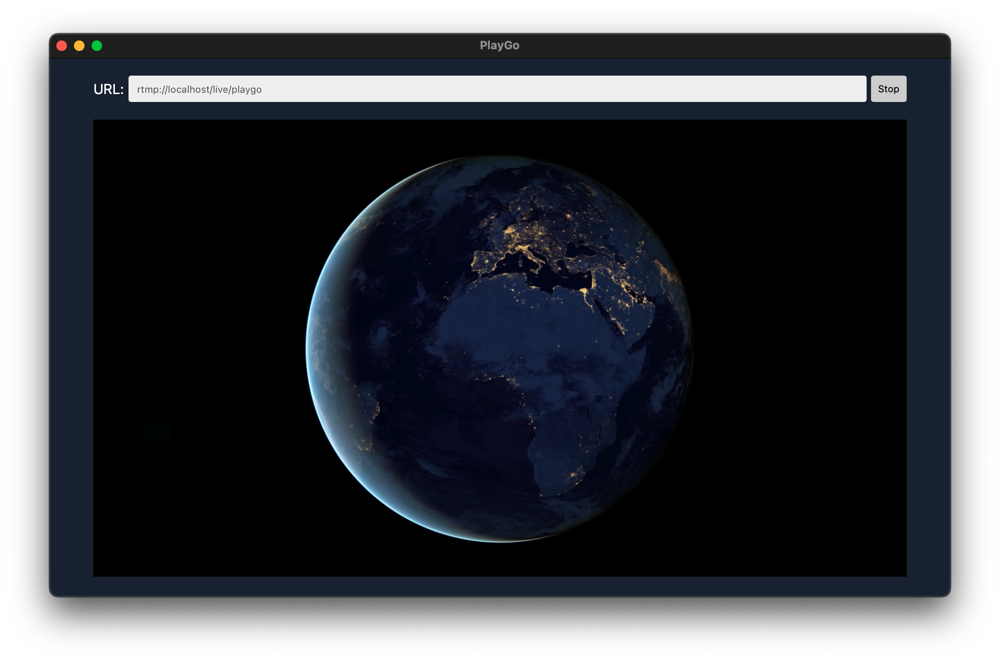

# PlayGo


**PlayGo** is a simple streaming video player built with [Wails](https://wails.io/).

## Features
PlayGo supports a wide range of streaming protocols, local file formats, and online platforms.

### Supported Protocols
| Protocol | Video Codec | Audio Codec | Container |
|--|--|--|--|
| RTSP / RTSPS | H264 | AAC | - |
| RTMP / RTMPS | H264, H265 | AAC | FLV |
| HTTP-FLV / HTTPS-FLV | H264 | AAC | FLV |
| HTTP-TS / HTTPS-TS | H264 | AAC | TS |
| HTTP-MP4 / HTTPS-MP4 | H264 | AAC | MP4 |
| HLS / LL-HLS | H264 | AAC | TS, fMP4 |
| SRT | H264 | AAC | TS |

### Local File Playback
| Extension | Video Codec | Audio Codec |
|--|--|--|
| FLV | H264 | AAC |
| TS | H264 | AAC |
| MP4 | H264 | AAC |

### Supported Platforms
The following platforms are supported via direct URL input.
| Platform | Service | Example |
|--|--|--|
| YouTube | Video | https://www.youtube.com/watch?v={videoID} |
| YouTube | Live | https://www.youtube.com/live/{videoID} |
| YouTube | Shorts | https://www.youtube.com/shorts/{videoID} |
| YouTube | Kids | https://www.youtubekids.com/watch?v={videoID} |
| YouTube | Music | https://music.youtube.com/watch?v={videoID} |
| CHZZK | Live | https://chzzk.naver.com/live/{channelID} |
| CHZZK | Clip | https://chzzk.naver.com/clips/{clipID} |

### General Features
- Cross-platform support (Windows, macOS, Linux)
- Simple and intuitive user interface
- Always on top

## Build
To build the application, make sure [Wails](https://wails.io/) is installed:
```bash
wails build
```

## Running on Linux
On Linux, you may need to install additional packages like `gstreamer1.0-plugins-bad`.

For example, on Debian/Ubuntu-based systems:
```bash
sudo apt-get install gstreamer1.0-plugins-bad
```